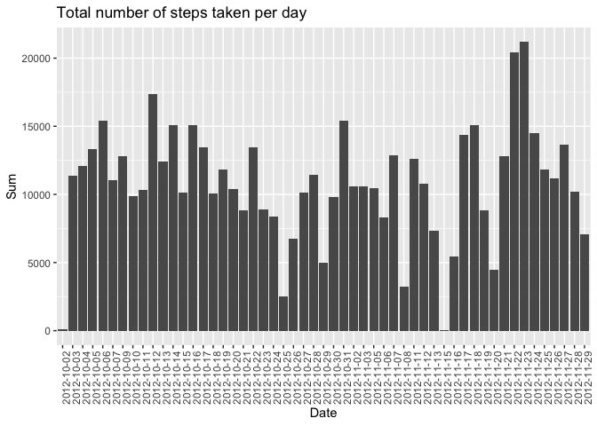
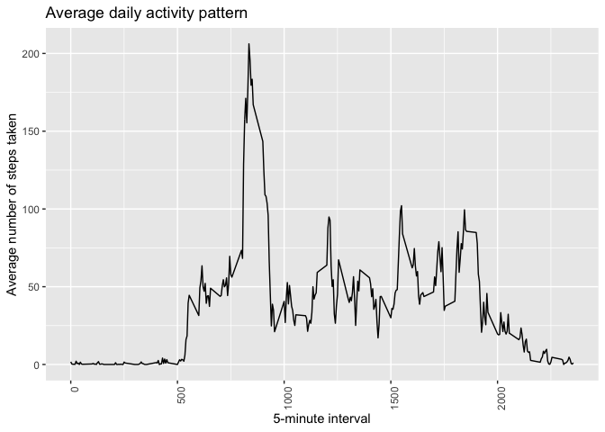
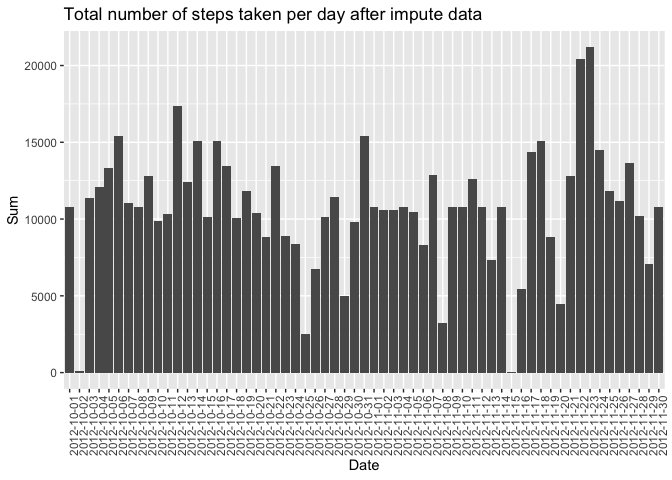
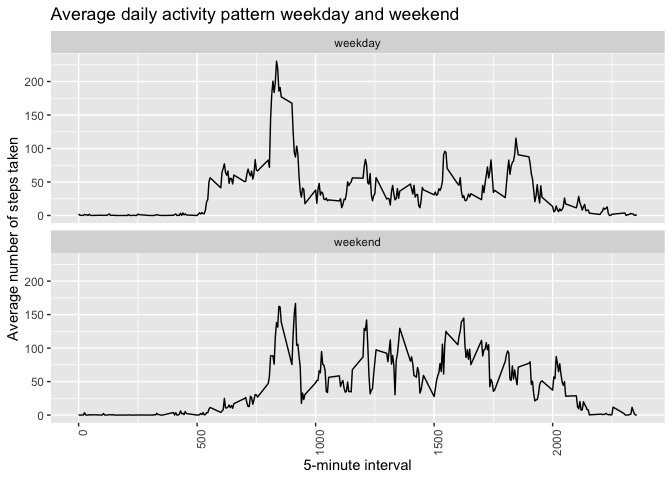

**1 Loading and preprocessing the data**

*1.1 Load the data (i.e. read.csv())*

```r
# Load the ggplot2 library
library(ggplot2)
library(Hmisc)
unzip ("activity.zip", exdir = "./")
data <- read.csv("activity.csv")
```
**2 Process/transform the data (if necessary) into a format suitable for your analysis**

*2.1 What is mean total number of steps taken per day?*

```r
# sum steps by date and remove na value
dataGroupByDate <- aggregate(steps ~ date, data, sum, na.rm=TRUE)

# Rename to make column clear
colnames(dataGroupByDate)[colnames(dataGroupByDate) == 'steps'] <- 'sum'

# Plot bar graph represent sum of steps in each day
ggplot(dataGroupByDate, aes(x=date, y=sum)) + geom_bar(stat="identity", na.rm = TRUE)+ theme(axis.text.x = element_text(angle = 90, hjust = 1)) + ylab('Sum') + xlab('Date') + labs(title = 'Total number of steps taken per day')
```

<!-- -->

*2.3 Calculate and report the mean and median of the total number of steps taken per day*

*2.3.1 Mean of the total number of steps taken per day*

```r
mean(dataGroupByDate$sum, na.rm = TRUE)
```

```
## [1] 10766.19
```

*2.3.2 Median of the total number of steps taken per day*

```r
# median steps by date and remove na value
median(dataGroupByDate$sum, na.rm = TRUE)
```

```
## [1] 10765
```

**3 What is the average daily activity pattern?**

*3.1 Make a time series plot (i.e. type = "l") of the 5-minute interval (x-axis) and the average number of steps taken, averaged across all days (y-axis)*

```r
# sum steps by interval and remove na value
dataGroupByInterval <- aggregate(steps ~ interval, data, mean, na.rm = TRUE)

# Rename to make column clear
colnames(dataGroupByInterval)[colnames(dataGroupByInterval) == 'steps'] <- 'mean'

# Plot line graph represent sum of steps in each day
ggplot(dataGroupByInterval, aes(x=interval, y=mean)) + geom_line(na.rm = TRUE)+ theme(axis.text.x = element_text(angle = 90, hjust = 1)) + ylab('Average number of steps taken') + xlab('5-minute interval') + labs(title = 'Average daily activity pattern')
```

<!-- -->

*3.2 Which 5-minute interval, on average across all the days in the dataset, contains the maximum number of steps?*

```r
dataGroupByInterval[which.max(dataGroupByInterval$mean),]
```

```
##     interval     mean
## 104      835 206.1698
```


**4 Imputing missing values Note that there are a number of days/intervals where there are missing values (coded as NA). The presence of missing days may introduce bias into some calculations or summaries of the data.**

*4.1 Calculate and report the total number of missing values in the dataset (i.e. the total number of rows with NA)*

```r
sum(is.na(data$steps))
```

```
## [1] 2304
```

*4.2 Devise a strategy for filling in all of the missing values in the dataset. The strategy does not need to be sophisticated. For example, you could use the mean/median for that day, or the mean for that 5-minute interval, etc.*

```r
imputedData <- merge(data, dataGroupByInterval, by=c("interval"))
imputedData[is.na(imputedData$steps), "steps"] <- imputedData[is.na(imputedData$steps), 'mean']
```

*4.3 Create a new dataset that is equal to the original dataset but with the missing data filled in.*

```r
imputedData <- subset(imputedData, select=-c(mean))
```

*4.4 Make a histogram of the total number of steps taken each day and Calculate and report the mean and median total number of steps taken per day. Do these values differ from the estimates from the first part of the assignment? What is the impact of imputing missing data on the estimates of the total daily number of steps?*

*4.4.1 Histogram of the total number of steps taken each day*

```r
# sum steps by date and remove na value
imputedDataGroupByDate <- aggregate(steps ~ date, imputedData, sum, na.rm=TRUE)

# Rename to make column clear
colnames(imputedDataGroupByDate)[colnames(imputedDataGroupByDate) == 'steps'] <- 'sum'

# Plot bar graph represent sum of steps in each day
ggplot(imputedDataGroupByDate, aes(x=date, y=sum)) + geom_bar(stat="identity", na.rm = TRUE)+ theme(axis.text.x = element_text(angle = 90, hjust = 1)) + ylab('Sum') + xlab('Date') + labs(title = 'Total number of steps taken per day after impute data')
```

<!-- -->

*4.4.2 Report the mean of the total number of steps taken per day*

```r
mean(imputedDataGroupByDate$sum, na.rm = TRUE)
```

```
## [1] 10766.19
```

*4.4.3 Report the median of the total number of steps taken per day*

```r
# median steps by date and remove na value
median(imputedDataGroupByDate$sum, na.rm = TRUE)
```

```
## [1] 10766.19
```

*4.4.4 Do these values differ from the estimates from the first part of the assignment?*  
Mean is not changed, Median is changed.

*4.4.5 What is the impact of imputing missing data on the estimates of the total daily number of steps?*  
It's small increase the median, not effect the mean.

**5 Are there differences in activity patterns between weekdays and weekends? For this part the weekdays() function may be of some help here. Use the dataset with the filled-in missing values for this part.**

*5.1 Create a new factor variable in the dataset with two levels – “weekday” and “weekend” indicating whether a given date is a weekday or weekend day.*

```r
imputedData$date <- as.Date(imputedData$date)
imputedData$week <- ifelse(weekdays(imputedData$date) %in% c("Saturday", "Sunday"), "weekend", "weekday")
```

*5.2 Make a panel plot containing a time series plot (i.e. type = "l") of the 5-minute interval (x-axis) and the average number of steps taken, averaged across all weekday days or weekend days (y-axis). See the README file in the GitHub repository to see an example of what this plot should look like using simulated data.*

```r
imputedDataGroup <- aggregate(steps ~ interval + week, imputedData, mean)

# Plot bar graph represent sum of steps in each day
ggplot(imputedDataGroup, aes(x=interval, y=steps)) + geom_line(na.rm = TRUE) + facet_wrap(~week, nrow=2, ncol=1) + theme(axis.text.x = element_text(angle = 90, hjust = 1)) + ylab('Average number of steps taken') + xlab('5-minute interval') + labs(title = 'Average daily activity pattern weekday and weekend')
```

<!-- -->
